Introduction. Dataset Overview
==============================

In this work I will be analysing popularity of online news, specifically
- what features can possibly help us to predict the number of shares?

The source dataset can be downloaded from UCI repository: [see
here](http://archive.ics.uci.edu/ml/datasets/Online+News+Popularity).

This dataset contains information about the articles published on
Mashable.com during a two-year period. Popularity is measured by the
number of shares since the publication date. An article is considered
popular if it exceed the threshold of 1400 shares (as suggested by the
dataset creators).

Variables Transformation
========================

The dataset contains 39797 observations with 61 attributes - real and
integers. However, conceptually the dataset contains categorical
variables as well which are encoded as integers (for example, channel
name and weekday name). Such encoding is very convenient for prediction
models. However, for the sake of plotting we will convert the dummy
variables back to categorical variables. The following new categorical
variables will be created:

-   weekend (one of: Monday, Tuesday, Wednesday, Thursday, Friday,
    Saturday, Sunday)  
-   channel (one of: LifeStyle, Entertainment, Business, Social Media,
    Tech, World, Other (if it’s not in one of the channels))  
-   topic (the topic with the maximum value for Latent Dirichlet
    Allocation is selected, one of: Topic 1, Topic 2, Topic 3, Topic 4,
    Topic 5)

Univariate EDA
==============

News Examples: Best and Worst
-----------------------------

Before we dive into exploring variables, it’s interesting to take a
quick look what news are the most/least readable.

### Best Stories

    ##                                                                       url
    ## 9366                      http://mashable.com/2013/07/03/low-cost-iphone/
    ## 5371              http://mashable.com/2013/04/15/dove-ad-beauty-sketches/
    ## 23238 http://mashable.com/2014/04/09/first-100-gilt-soundcloud-stitchfix/
    ## 16269          http://mashable.com/2013/11/18/kanye-west-harvard-lecture/
    ## 3146                    http://mashable.com/2013/03/02/wealth-inequality/
    ##       shares timedelta
    ## 9366  843300       554
    ## 5371  690400       633
    ## 23238 663600       274
    ## 16269 652900       416
    ## 3146  617900       677

### Worst Stories

    ##                                                                    url
    ## 17267              http://mashable.com/2013/12/09/wand-remote-control/
    ## 4710  http://mashable.com/2013/04/01/troll-appreciation-day-tickets-2/
    ## 38634                  http://mashable.com/2014/12/10/mad-max-trailer/
    ## 9772                  http://mashable.com/2013/07/11/nokia-lumia-1020/
    ## 18958       http://mashable.com/2014/01/16/titanic-replica-theme-park/
    ##       shares timedelta
    ## 17267      1       395
    ## 4710       4       647
    ## 38634      5        28
    ## 9772       8       546
    ## 18958     22       357

Number of Shares
----------------

Numeric Summary:

    ##    Min. 1st Qu.  Median    Mean 3rd Qu.    Max. 
    ##       1     946    1400    3395    2800  843300

The distribution of the number of shares of the original data is highly
skewed (right-skewed), so there are two plots: the first one shows
original data, the second one is without outliers (omitting values
abouve Q3 + 1.5\*IQR).

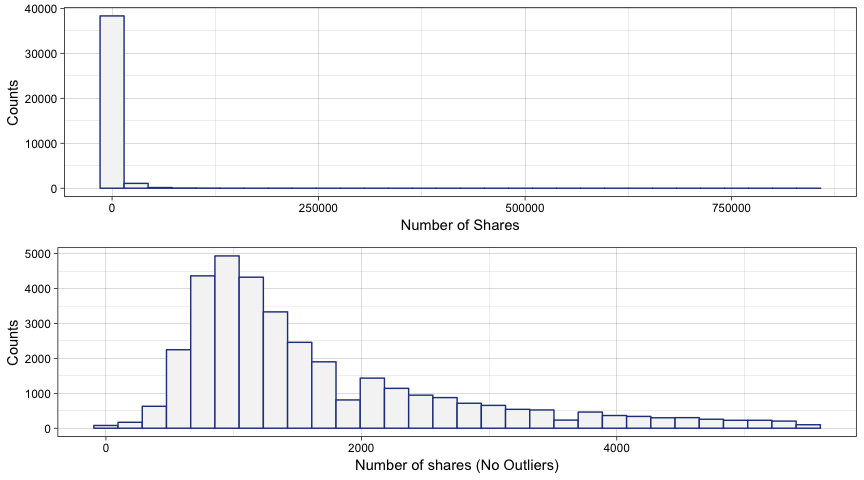

Since the distribution is so heavily skewed, it is reasonable to remove
outliers so that we work with more balanced data. We will consider
everything that is above Q3 + 1.5\*IQR as an outlier.

Days of the Week
----------------

Summary:

    ##    Monday   Tuesday Wednesday  Thursday    Friday  Saturday    Sunday 
    ##      5864      6576      6637      6501      5076      2113      2336

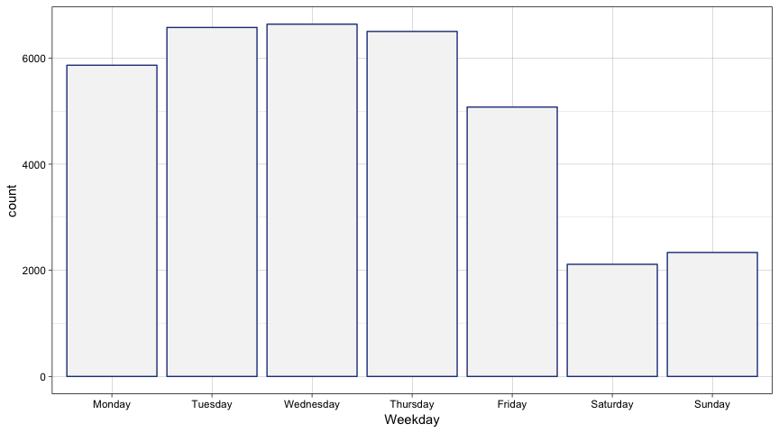

There are significantly fewer publications on weekends. We should
explore if there are fewer shares on weekends as well.

News Channels
-------------

    ##     Lifestyle Entertainment      Business  Social Media          Tech 
    ##          1798          6347          5749          1989          6549 
    ##         World         Other 
    ##          7878          4793

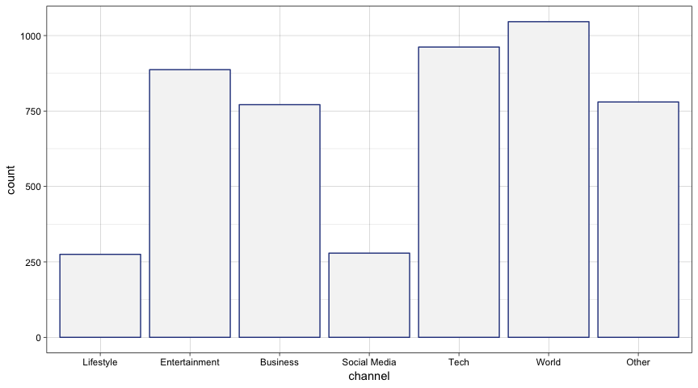

Surprisingly, Lifestyle and Social Media channels get significantly
fewer publications that any other channels. Also, there is significant
amoung of news not assigned to any chanel, so we should account for
that.

News Topics
-----------

    ## Topic 1 Topic 2 Topic 3 Topic 4 Topic 5 
    ##    6587    4256    8113    7601    8546

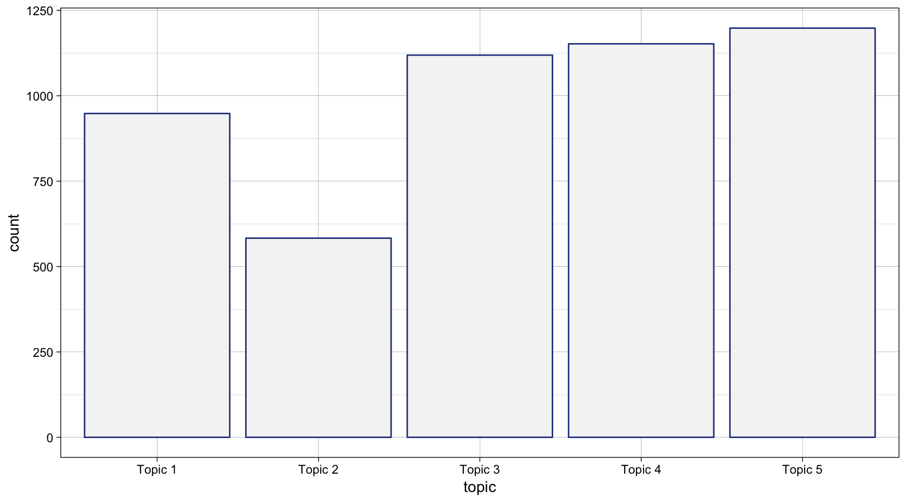

We see that Topic 2 is the least covered on Mashable, while news on
Topics 4 and 5 are published more often.

Title and Text Length
---------------------

The length of the text/title is measured in the number of tokens (not
necessarily distinct). In the very basic case, the stop words are not
excluded, so we’re simply measuring text/title length with the number of
words in it.

    ##  n_tokens_title n_tokens_content
    ##  Min.   : 2.0   Min.   :   0.0  
    ##  1st Qu.: 9.0   1st Qu.: 250.0  
    ##  Median :10.0   Median : 414.0  
    ##  Mean   :10.4   Mean   : 546.8  
    ##  3rd Qu.:12.0   3rd Qu.: 715.0  
    ##  Max.   :20.0   Max.   :7764.0

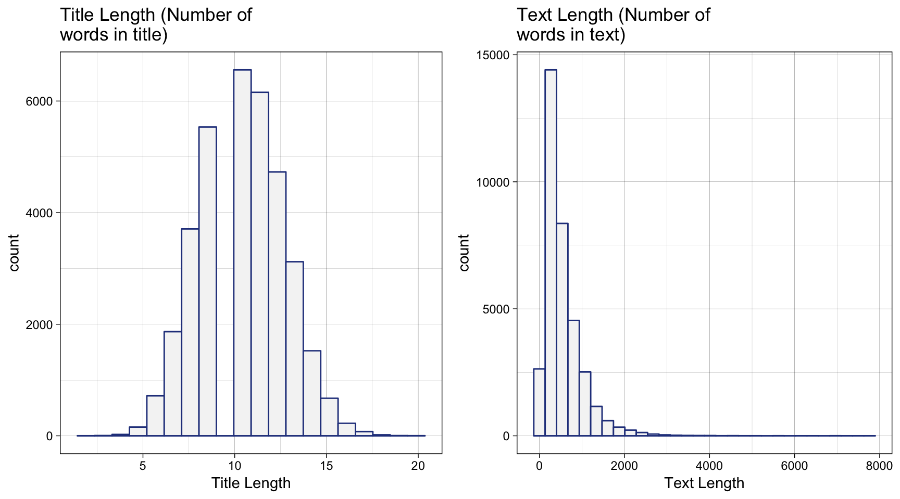

There is one interesting thing that we can notice here. There is quite
large number of news with zero number of words! Does it even make sense?

To be precise, there are 970 of them. Let’s see if they contain anything
instead:

    ##         counts
    ## Videos     661
    ## Images     290
    ## Links        0
    ## Nothing     88

Looks like there are 78 news bits that don’t have any content at all!
Let’s actually look at the titles with supposedly no content:

    ##  [1] http://mashable.com/2013/01/23/fitness-gadget-gym-cost-comparison/
    ##  [2] http://mashable.com/2013/01/25/data-vs-nature-infographic/        
    ##  [3] http://mashable.com/2013/01/29/social-tv-chart-1-29/              
    ##  [4] http://mashable.com/2013/01/30/davos-social-media-2/              
    ##  [5] http://mashable.com/2013/01/31/nfl-super-bowl-facebook/           
    ##  [6] http://mashable.com/2013/02/04/super-bowl-social-media/           
    ##  [7] http://mashable.com/2013/02/05/online-dating-habits/              
    ##  [8] http://mashable.com/2013/02/05/social-tv-chart-2-5/               
    ##  [9] http://mashable.com/2013/02/05/teachers-technology-infographic/   
    ## [10] http://mashable.com/2013/02/12/social-tv-chart-2-12/              
    ## 39644 Levels: http://mashable.com/2013/01/07/amazon-instant-video-browser/ ...

And, surprisingly, they still get a lot of shares! There must be
something wrong. Let’s check one news article from this list -
<http://mashable.com/2013/01/23/fitness-gadget-gym-cost-comparison/>.
Turns out, it contains a lot text and a lof images! We can conclude that
these observations might be corrupted! Do those with no text really have
no text then? Let’s see:

    ## [1] http://mashable.com/2013/01/23/actual-facebook-graph-searches/
    ## 39644 Levels: http://mashable.com/2013/01/07/amazon-instant-video-browser/ ...

[The
link](#'http://mashable.com/2013/01/23/actual-facebook-graph-searches/')
leads to an article named “Tumbrl Serves Up Hilariously Awful ‘Actual
Facebook Graph Searches’” that does have text! We can suspect, that
actually these news that are reported to have zero number of words were
actually parsed incorrectly. We could have written our own parser, but
this is outside of the scope of this work, so we will just remove these
observations from the dataset.

Also, at this point we can create another categorical variable that will
split texts by length. We will create 3 buckets: - Short texts: 0-400
words - Medium: 400-1000 words - LongReads: over 1000 words

    ##    Short   Medium LongRead 
    ##    16030    13717     4386

Videos and Links
----------------

Summary:

    ##    num_hrefs      num_self_hrefs       num_imgs         num_videos    
    ##  Min.   :  0.00   Min.   :  0.000   Min.   :  0.000   Min.   : 0.000  
    ##  1st Qu.:  5.00   1st Qu.:  1.000   1st Qu.:  1.000   1st Qu.: 0.000  
    ##  Median :  8.00   Median :  3.000   Median :  1.000   Median : 0.000  
    ##  Mean   : 10.89   Mean   :  3.391   Mean   :  4.352   Mean   : 1.199  
    ##  3rd Qu.: 13.00   3rd Qu.:  4.000   3rd Qu.:  3.000   3rd Qu.: 1.000  
    ##  Max.   :187.00   Max.   :116.000   Max.   :128.000   Max.   :75.000

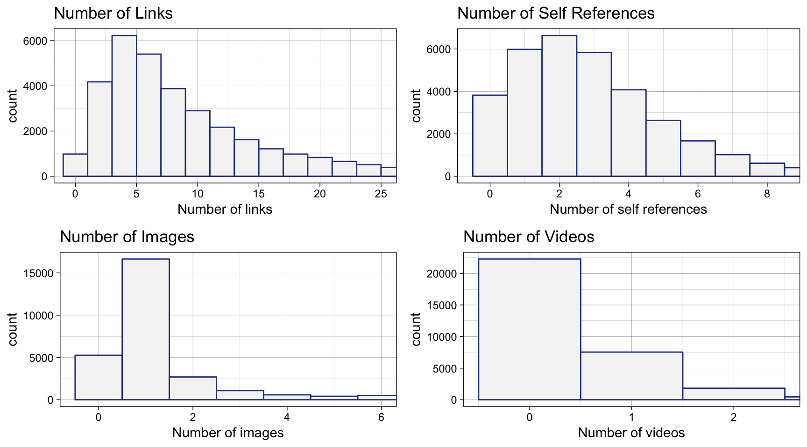

All of the above histograms are right-skewed - most values are
concentrated on the left, so smaller values are more typical. We see
that an average text has 10 links (including 3 self-references), 4
images an 1 video (but not necessarily all these at the same time).

Text Semantics
--------------

### Subjectivity and Polarity

Polarity measures the emotions expressed in the text. In this dataset
polarity values are in the continuous interval from -1 to 1 (inclusive).
Closeness to -1 means that text has negative sentiment, while closness
to +1 means positive sentiment.

Subjectivity simply measures how subjective is the text (i.e. if it
expresses an opinion or states a fact). Subjectivity of 0 will indicate
that the text simply states the facts, while subjectivity close to 1
will indicate that the text is an opinion rather than a bunch of facts.

    ##  global_subjectivity global_sentiment_polarity title_subjectivity
    ##  Min.   :0.0000      Min.   :-0.3937           Min.   :0.0000    
    ##  1st Qu.:0.3997      1st Qu.: 0.0638           1st Qu.:0.0000    
    ##  Median :0.4537      Median : 0.1216           Median :0.1000    
    ##  Mean   :0.4540      Mean   : 0.1223           Mean   :0.2753    
    ##  3rd Qu.:0.5070      3rd Qu.: 0.1791           3rd Qu.:0.5000    
    ##  Max.   :1.0000      Max.   : 0.7278           Max.   :1.0000    
    ##  title_sentiment_polarity
    ##  Min.   :-1.00000        
    ##  1st Qu.: 0.00000        
    ##  Median : 0.00000        
    ##  Mean   : 0.06838        
    ##  3rd Qu.: 0.13636        
    ##  Max.   : 1.00000

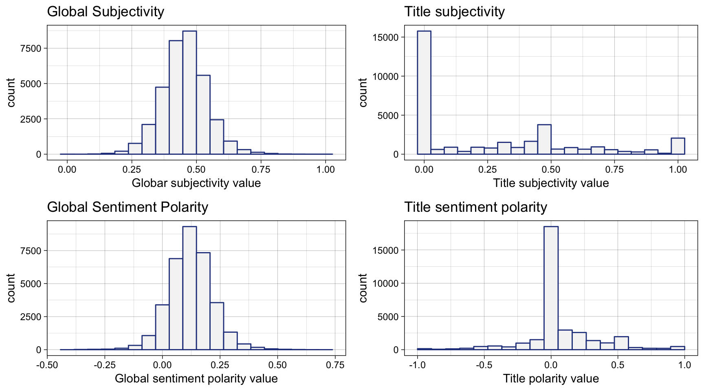

We can note that global subjectivity has normal distribution with the
mean a bit shifted to the left from 0.5, so most of the texts tend to be
neutrality. And if we look at the same characteristic of the title, we
will notice that there is a very explicit peak at 0 that tells us that
significant proportion (specifically - 0.4617233) of all news titles
simply state facts.

The distribution for the text sentiment polarity looks normal with the
mean shifted to the right from 0 which means that in general the
newswriters prefer to be “positive”. However, when it comes to naming
the news, the authors mostly (0.5094483 of the titles) prefer neutral
style.

### Negative and Positive Words Rates

Global rate of positive/negative words shows the percentage of
positive/negative words in the whole text. For the following histogram I
decided to combine them and plot the histogram for the proportion of
non-neutral tokens in the text.

Rate of positive words shows the percentage of positive words among all
non-neutral tokens. For this plot I took a subset of all the news the do
contain any non-neutral words, because the rate of 0 can also mean that
there are no non-neutral words at all.

Numerica summary for global rate of non-neutral words and globalr rate
of positive words:

    ##    Min. 1st Qu.  Median    Mean 3rd Qu.    Max. 
    ## 0.00000 0.04448 0.05634 0.05774 0.06925 0.20339

    ##    Min. 1st Qu.  Median    Mean 3rd Qu.    Max. 
    ##  0.0000  0.6129  0.7143  0.7033  0.8000  1.0000

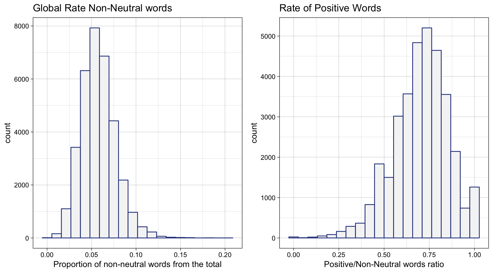

We can conclude that the texts mostly have low proportion of non-neutral
words. And for the non-neutral tokens we can see that the histogram is
left-skewed - most news are positive. It’s interesting to note that
there are much more news that have only positive and no negative words
than news with just negative words (bars at 0 and at 1).

Univariate Analysis
===================

Dataset Structure
-----------------

Original dataset contains 39644 observations with 61 attributes. The
attributes are float, integer and categorical. The distribution of the
variable of interest (shares) is heavily skewed, so we had to remove the
outliers.

Main Feature of Interest
------------------------

We’re interested in exploring how the number of shares is relates to
other variables.

Feature to Support the Feature of Interest
------------------------------------------

-   the subjectivity/polarity of title/text
-   the number/presece of images
-   the length of the text
-   the data channel
-   the day of publication
-   the topic

Additional Features
-------------------

I createed several variables during the first stage:

-   weekday (decodes dummy variables)
-   channel (decodes dummy variables)
-   other (to identify that the channel is other)
-   topic’ that stores the topic that has the highest value of
    membership according to LDA
-   text\_length (categorical variabl that splits all texts into 3
    categories: Short, Medium, LongRead)  
-   contains\_images (indicates if the text contains images)

Unusual Distributions and Variable Transformations
--------------------------------------------------

Most of the distributions are right-skewed, which seems quite logical.
There are only two plots that show almost normal distribution:

-   global subjectivity  
-   global sentiment polarity
-   number of words in title

I’ve also sclaed the distribution of the numer of shares using log
scale, because the data contains extreme values (outliers) that make it
hard to see the shape. Also, it looks like for the goals of prediction
we should better get rid of outliers - they are extreme values that
happen rarely so it doesn’t make sense to analyse them together with
other oservations.

One interesting distribution is the distribution of the rate of positive
words - it’s left-skewed for the articles that contain any non-neutral
tokens. Also the distributions of the title polarity and subjectivity
have very clear peak at the “neutral position” which means that most
titles are neutral (both in terms of subjectivity and polarity).

Bivariate EDA
=============

Older =&gt; more popular?
-------------------------

One natural question that one may ask this data is whether the news get
more shares as more and more days pass? The smallest time interval
between the publication data and data acquisition date (in days) is 8.
So we’re not comparing total novices to old monsters. Then it makes
sense to plot the number of shares against the number of days elapsed:

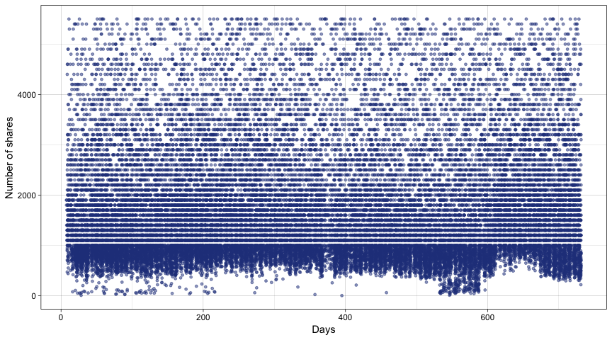
One might expect that as time goes by, the text will naturally will gain
more shares, but the two variables look completely uncorrelated. And,
indeed, the correlation coefficient is just 0.0391677

We can explain it by the fact that new articles become outdated very
fast, so if it’s not shared intensively in the first 8 days, then it
will not become significantly more popular no matter how long it stays
on the site. But this is actually good for our analysis, because it
justifies our measure of the popularity in the number of shares even if
for the texts with very different publication dates.

Numeric Characteristics of the Texts
------------------------------------

Let’s see if there is some relationship between the number of shares and
numeric characteristics of the text, such as: - title length - text
length - number of links - number of images - number of videos

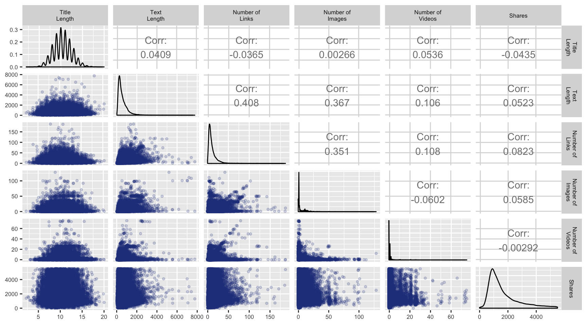

It doesnt look like any of the variables are highly or even moderately
related to the number of shares. The highest we see is the correlation
of 0.0823 and 0.0585 and 0.0523 between the average number of shares per
day and the number of references and images and text length. As for the
other variables, we can see moderate correlation between: - the number
of references and the text length (0.408); - the number of images and
the text length (0.367); - the number of images and the number of
references (0.351);

Here it makes sense to stop and think about the variables we’re
assessing. Maybe it’s not the number of images that influence the number
of shares, but it’s their presence that can make a difference? Let’s
create a variable for that and call it “contains\_images”.

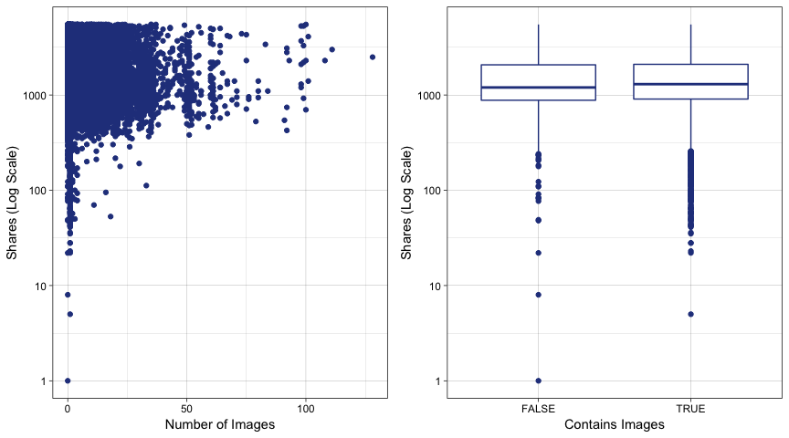

There is some difference but it’s very weak - maybe it’s more explicit
in some specific categories? We should explore it in multivariate
analysis section.

    ##   contains_images median
    ## 1           FALSE   1200
    ## 2            TRUE   1300

Sematnic Characteristics of the Texts
-------------------------------------

Next, we can check if there is any relationshiip between the number of
shares and semantic characteristics of the text, such as: - global
subjectivity - global sentiment polarity - global rate of positive words
- global rate of negative words - rate of positive words

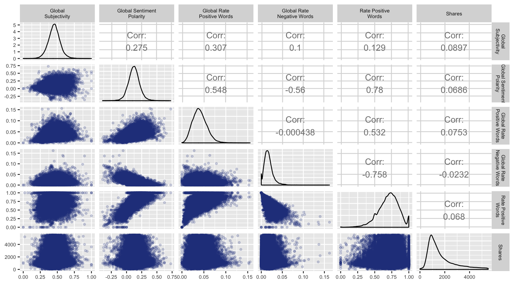

Again, we can see that there are no strong correlations between the
number of shares and other variables. There is some very very weak
positive correlation between the number of shares and text subjectivity
and global rate of positive words.

Note: we should be very careful with these attributes: we shouldn’t use
rate of positive words, global rate of positive words and global
sentiment polarity if we ever decide to build a model because these
three variable are correlated (which is quite logical).

As a final step for text characteristics, let’s see how the
characteristics themselves are related to each other:

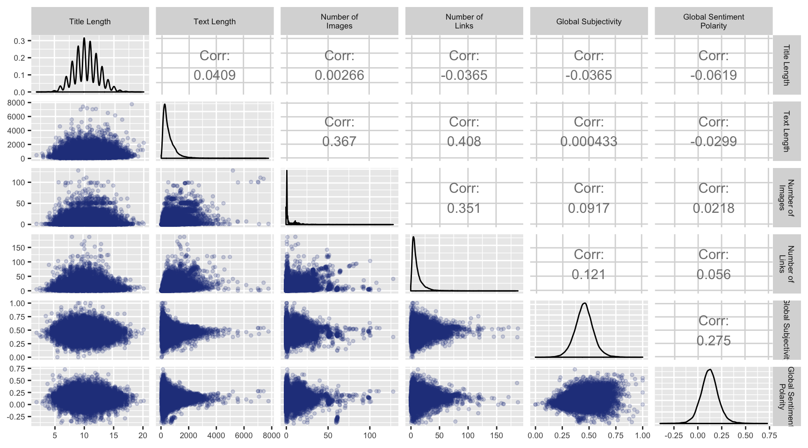

I expected to see some negative correlation between the number of links
and subjectivity (links might be used to reference some facts to prove
the point), but the result was the oppositte. One possible explanation
is that at the same time links can also mean references to the
image/video sources. Nevertheless, the correlation is too small to claim
anything.

Shares by Weekday
-----------------

In the univariate analysis we noticed that weekend gets much fewer
publications than work days. What about the shares of the news published
on weekend? Do these news go unnoticed by the audience?

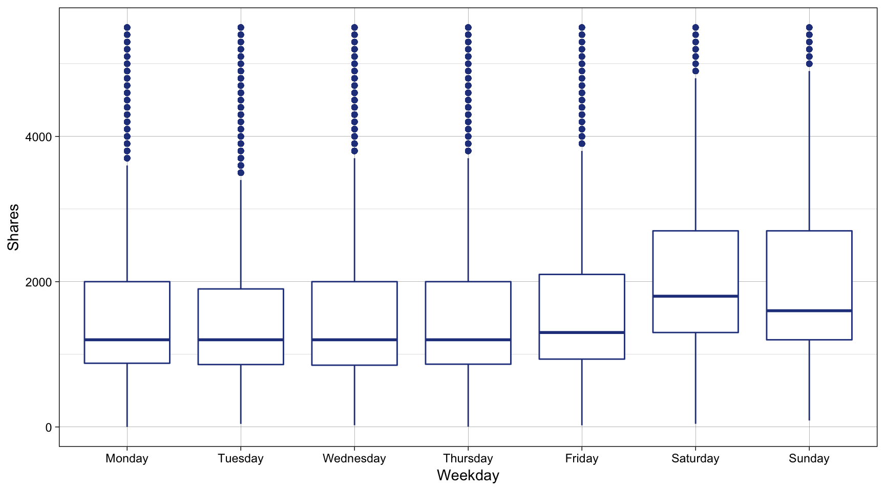

Quite the opposite! Even though there are less news published on
weekend, those that published get significnatly more shares, especially
on Saturday. It doesn’t mean that one causes another, of course. One
guess is that on weekend people have more time to actually read the news
thoroughly and of course they first look at those that were just
published. It’s interesting to check if weekend news are longer than
work day news:

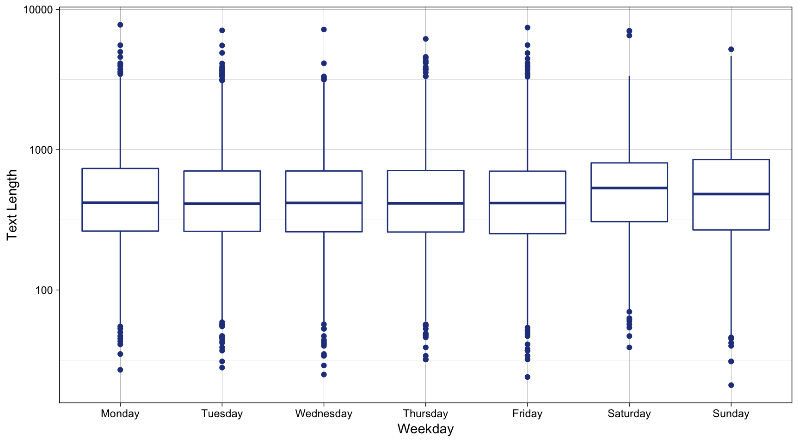

And indeed - it looks like weekends texts (especially those published on
Saturday) are are slightly longer:

    ##     weekday median
    ## 1    Monday    419
    ## 2   Tuesday    413
    ## 3 Wednesday    418
    ## 4  Thursday    414
    ## 5    Friday    417
    ## 6  Saturday    533
    ## 7    Sunday    483

### Shares by Channel

The next question is - are people more likely to share the news
published in specific channels?

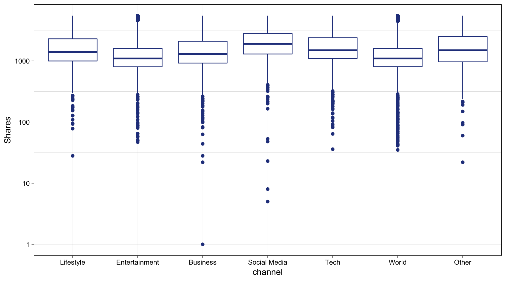

It looks like Entertainment and World news are the least shareable,
while Social Media news are the most shareable.

### Shares by Topic

Let’s check if we can see some pattern in the number of shares by topic:

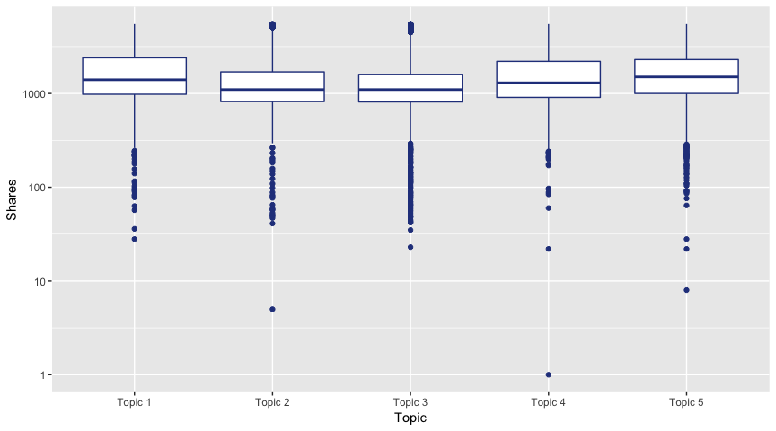

Looks like topics 1 and 5 are shared slightly more often than topics:

    ##     topic median
    ## 1 Topic 1   1400
    ## 2 Topic 2   1100
    ## 3 Topic 3   1100
    ## 4 Topic 4   1300
    ## 5 Topic 5   1500

But what do these topics mean?

### What Do Topics Mean?

Since we don’t have access to the original data scraping script, we can
only guess what the topics are about. One way to get some idea of what
the topics are about is to see how these anonymous topics distributed
across channels:

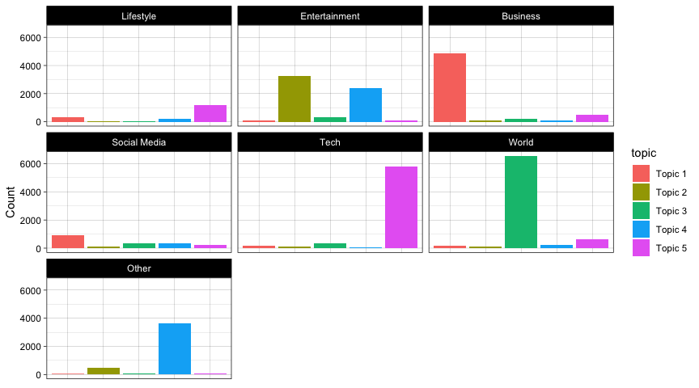

And indeed we can make some conclusions based on these barplots:

-   topic 1 is related to business
-   topic 5 is related to technology
-   topic 3 is related to world news
-   topic 2 is related to entertainment

Taking into account our previous visualisation, we can now say that news
about business and technology are better candidates for popular news
than anything else.

Number of Links, Number of Images vs Number of Shares
-----------------------------------------------------

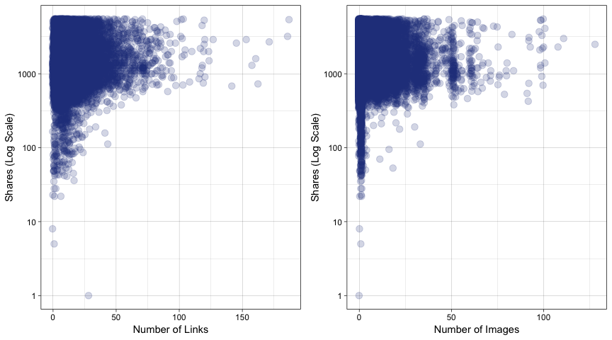

The correlation is very weak and is barely identifiable on the plot, so
we should not rely on it.

Being Objective Doesn’t Make You Popular
----------------------------------------

When first approaching this dataset, I expected that there will be some
moderate correlation between the subjectivity and the number of shares.
On one hand, factual news are more reliable and so “safer” to share. On
the other hand, more subjective news are more appealing. So maybe these
two thing balance each other out instead? Hence, the low value of the
correlation coefficient - 0.0896518.

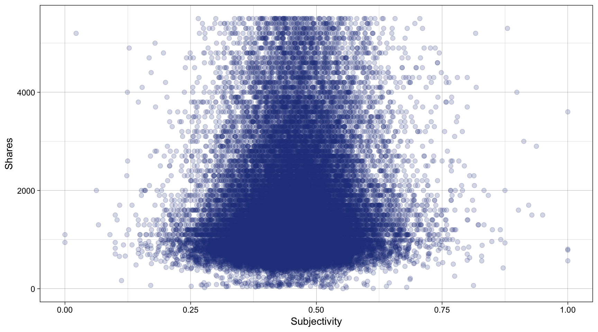

The plot can serve as an example of absolute patternlessness. I don’t
think we should build any models based on that.

Bivariate Analysis
==================

Observed Relationships
----------------------

It looks like our variable of interest (the number of shares) doesn’t
have any strong relationship with any of other variables. Correlation
values are very low and if we want to build a model, then maybe it will
make sense to cluster the dataset somehow and build a separate model for
each cluster, but this is out of the scope of this work.

That said, there are some weak, but rather interesting relationships. We
noticed that: - news published on weekend get more shares; - text length
has barely noticeable positive effect on the number of shares; - news
published in Social Media channel are shared more often, but at the same
time news on topics related to Technology and Business are more shared
(looks like we have some sort of Simpson’s paradox here!);

Relationships Between Features
------------------------------

One of the most interesting relationships is the relationship between
the weekday and text length. We’ve discovered that texts published on
weekends get more shares and are longer! At the same time, there are
fewer texts published on weekend and there is almost negligible
correlation between the text length and the number of shares.

Strongest Relationship?
-----------------------

The strongest relationship was among the variables that are innately
connected. These are global rate of positive/negative words and rate of
positive/negative words as well as subjectivity and polarity. So, as it
has been said, we should be very careful if we decide to build a model
with this variables. For example, positive words often indicate some
emotion that increases the subjectivity of the text, as well as
polarity, so we shouldn’t be surprised to see positive correlation
between them.

The most noticeable impact on the number of shares is from day of
publication and channel. As for continuous variables, the strongest
relationship (although still very weak) with the average number of
shares per day was shown by:

-   number of links;
-   number of images;
-   global subjectivity.

Multivariate EDA
================

Shares by Text Length: With Images vs Without Images
----------------------------------------------------

Previously, we noted that presence of images doesn’t influence the
number of shares that much. Let’s check if that’s true for all texts
independently of their length:

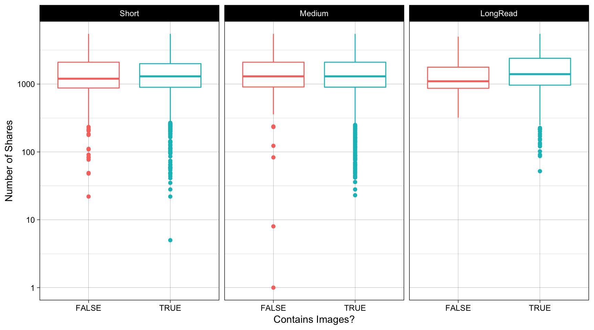

Looks like the presence of images has positive impact on the number of
shares for long reads. Also, it’s interesting that the median for the
number of shares is lower for long reads than for medium and short
texts, so long articles without images are the least shareable.

    ##   contains_images text_length median lower_fence upper_fence
    ## 1           FALSE       Short   1200      875.00        2100
    ## 2           FALSE      Medium   1300      906.25        2100
    ## 3           FALSE    LongRead   1100      866.00        1775
    ## 4            TRUE       Short   1300      897.00        2000
    ## 5            TRUE      Medium   1300      901.00        2100
    ## 6            TRUE    LongRead   1400      963.75        2400

Shares by topic by text length
------------------------------

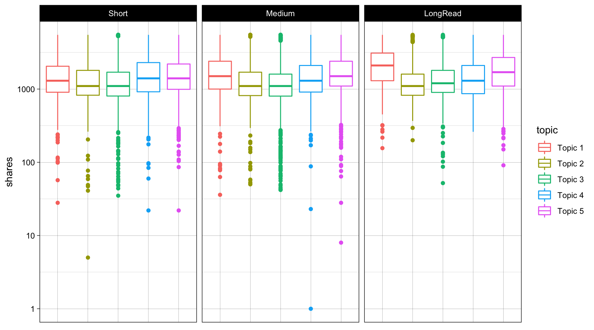

Here we can notice that long reads on topic 1 (Business) get the most
shares. The trend doesn’t hold for short texts: most popular short texts
are on topics 4 and 5 (Technology). Both observations seem quite
logical: long reviews in business topics and short technical news
(e.g. about some new gadget) are what seems worth sharing.

How are business and tech news affected by the presence of images?
------------------------------------------------------------------

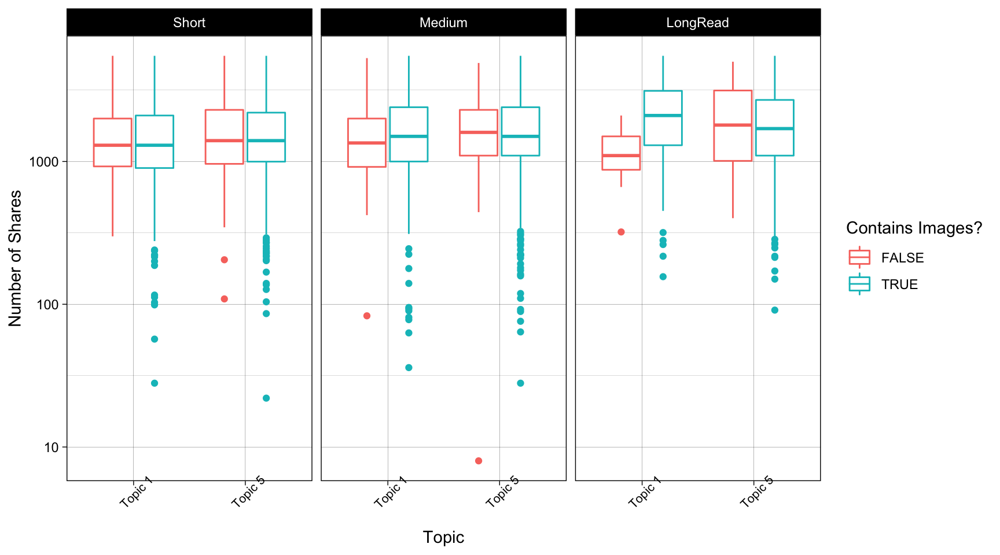

We can see that news related to Technology are less affected by the
absence of images, while for business long reads it looks like an
important feature.

Subjectivity vs Shares by Channel: Weekends and Workdays
--------------------------------------------------------

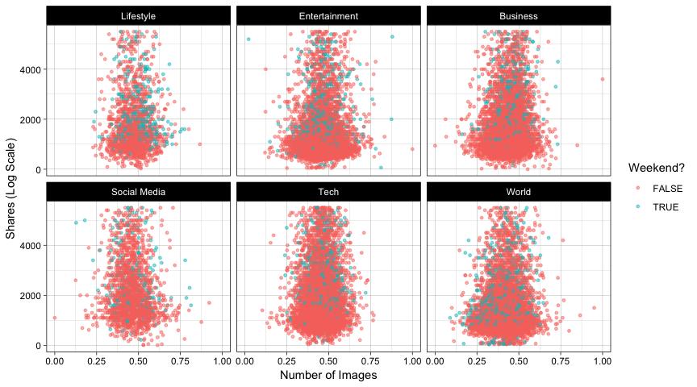

The scatter plots looks quite similar to each other (i.e. show no
correlation), but we may notice a few things. No matter what the channel
is, the subjectiviy of the text doesn’t influence it much as well as
other numeric characteristics. And we can again see that news published
on weekened are shifted up while news shared on workdays are more
concentrated on the bottom.

Multivariate Analysis
=====================

Observed Relationships
----------------------

One interesting finding is that presence of images has more impact on
long text rather than on shorter ones. However, it’s quite logical if
you think about it - it’s easier to read long text and get involved if
it has visuals. Also, we identified that business long reads is the top
shared category that strengthened our previous observation that tech and
business news are the most shared.

Inter-Feature Interactions
--------------------------

I tried various combinations, but it doesn’t look that there are more
connections. The most interesting connections have already been reported
in bivariate analysis section. Further exploration didn’t give anything.

### Possible Models

I decided not to build a model, because it doesn’t look like any of the
variables have really significan and measurable impact on the outcome
variables (i.e. we can’t predict based only on 0/1 columns). This work
was important to understand that numeric and basic semantic
characteristics are not enough to predict popularity.

------------------------------------------------------------------------

Final Plots and Summary
=======================

Plot One: News are Negatively Skewed in a Positive Way!
-------------------------------------------------------

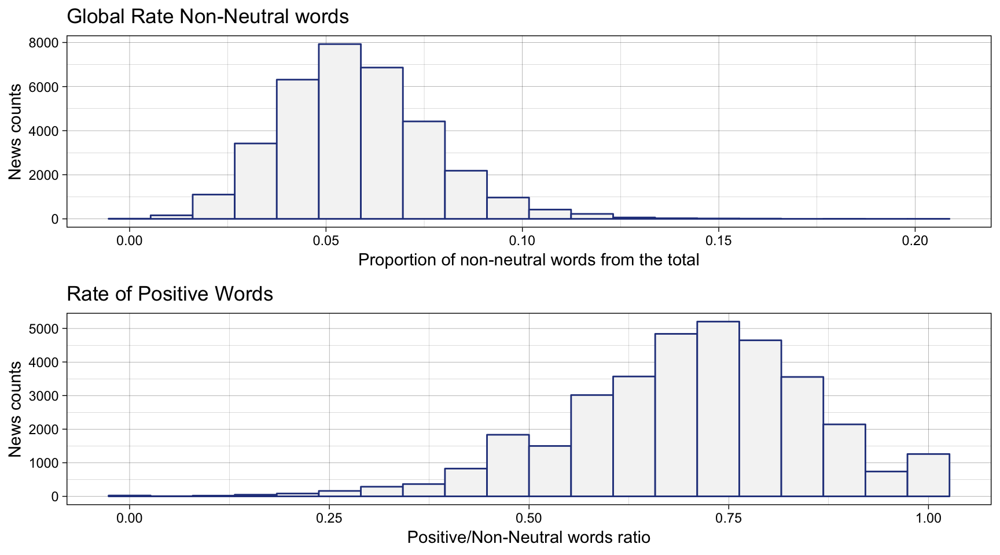

I live in Eastern Europe and based on the news I see every day here I
expected quite the opposite distribution: i.e., I expected that news
will be left-skewed in terms of rate of non-neutral words, while the
ratio of positive words to non-neutral words will be right skewed,
because it’s simply easier to draw one’s attention with bad news. But
it’s actually quite the opposite: the second histogram shows that in
fact, the distribution of positive words rations is left-skewed.
However, we don’t know if it’s because there is some latent advertising
that boosts the rate of positive words or the authors are just nice.

Plot Two: Weekends Get Fewer Publications, But More Shares
----------------------------------------------------------

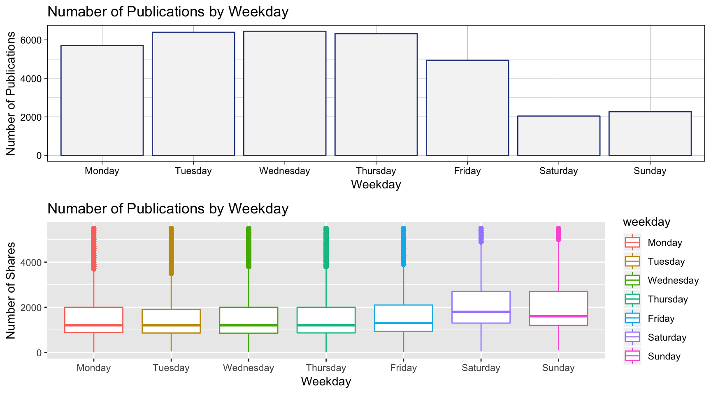

Another thing I found interesting is that there are significantly fewer
news published on weekend, but these news are shared the most -
especially on Saturdays. Maybe when the news article is shared on
weekend it spreads faster because people have more free time to actually
read (rather than just look at the title).

Plot Three: Top News Are Business Longreads with Images
-------------------------------------------------------

This is maybe the strongest relationship I was able to find. Compared to
other groups, business long reads show the best performance (we’ve
identified that Topic 1 is related to Business). Also, if we look closer
at business long reads that contain and don’t contain images, we will
see that the difference is quite dramatic, and this is the only category
where this pattern is so explicit.

------------------------------------------------------------------------

Reflection
==========

During this exploration, I realised one very important thing. We all
know about the GIGO principle. I think it also applies to data in most
cases. And this refers not only to the way the data was collected and
the way the measurements were taken. It’s also about collecting the
right data. Based on the exploration we’ve done it seems like it doesn’t
make much sense to predict news popularity based on numeric
characteristics, even if they measure some semantic features (although
very simple) as well.  
It doesn’t matter how positive and how good the text is - if it’s not
interesting, it will not get popular. Also this exploration shows how
important it is to be able to look at the actual data and if possible -
at the source of the data. It will help to detect potential errors in
the dataset - like when we discovered that zero-length texts just were
not processed correctly.

I had to create several helper variables converting from binary to
categorical variables and from continuous to categorical. One of these
transformations (presence of images rather than number of images) was
very fruitful - we’ve discovered that presence of images is very
important for business long reads.

I learnt the hard way that you shouldn’t stick top much to the varibales
you’re given - instead, you should play with them, transform and
sometimes, if necessary, admit that it still doesn’t work. The hardest
thing in this EDA was to admit that there is no correlation between the
number of shares and numeric attributes, no matter how desperately I
want to see them. Many times I was about to claim there was a
relationship, but in the end decided to simply reflect on the fact of
its absence. When you’re new to data analysis, you expect correlations
everywhere, so this was an introduction to real life.

The future research can be improved significantly by getting more data
about the news bits we have and maybe changing the metric we use to
measure popularity. For startesrs, I would have added a variable that
will measure the number of shares in the first week and take the ratio
from the total number of shares so that we can distinct between viral
news and quality timeless materials. Another idea is to extract the
keywords that describe the subject of each news bit and check the
popularity of these words with google trends - this might provide some
information for predicting popularity. Also, it looks reasonable to
categorise the texts by their type: e.g. “survey”, “picture gallery”,
“scandal”, “historical investigation” and so on and then explore
popularity within these categories.

References
==========

-   [Online News Popularity
    Dataset](http://archive.ics.uci.edu/ml/datasets/Online+News+Popularity)
-   [Chaning the Order of Levels of a
    Factor](http://www.cookbook-r.com/Manipulating_data/Changing_the_order_of_levels_of_a_factor/)
-   [Difference between Subjectivity and
    Polarity](https://www.quora.com/What-is-the-difference-between-Polarity-and-Subjectivity)
-   [What is good explanation of Dirichlet
    Allocation?](https://www.quora.com/What-is-a-good-explanation-of-Latent-Dirichlet-Allocation)
-   [Converting data between wide and long
    format](http://www.cookbook-r.com/Manipulating_data/Converting_data_between_wide_and_long_format/)
-   [Rename columns in R](http://rprogramming.net/rename-columns-in-r/)
-   [Plot some variables against many
    others](https://drsimonj.svbtle.com/plot-some-variables-against-many-others)
-   [How to change legend in
    ggplot](https://stackoverflow.com/questions/14622421/how-to-change-legend-title-in-ggplot#14622513)
